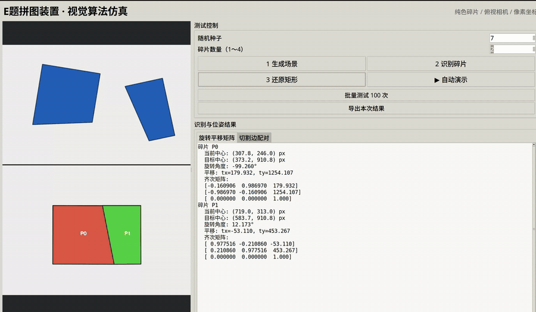

# 2026 年全国大学生电子设计竞赛 E 题：拼图装置

> 面向 2026 年全国大学生电子设计竞赛赛区赛（TI 杯）暨模拟电子系统设计
> 专题赛选拔赛 E 题“拼图装置”的视觉算法仿真、拼接求解与位姿输出程序。

这个项目生成一张随机切成 1～4 个多边形的矩形卡纸，把碎片随机旋转、平移并无重叠地摆放在 A4 纸上半区，然后**只从渲染图像**完成：

1. 颜色分割与多边形轮廓识别；
2. 根据切割边长度配对恢复碎片邻接关系；
3. 通过刚体变换拼回矩形；
4. 输出每块碎片从当前位置到下半区目标矩形的 3×3 齐次旋转平移矩阵。

碎片数量可在界面中设置为 1～4。算法根据数量生成直线切割或中心放射切割，
每块都有矩形外边，符合赛题“不超过 4 片、每片不超过 5 边、每片至少一条边位于目标矩形外边”的约束。
仿真目标矩形固定为 **10 cm × 6 cm**，使用 40 px/cm 的比例渲染为
400 px × 240 px；切割、还原与位姿输出共用这一尺寸定义。

## 演示

### 4 块碎片



[查看 4 块碎片高清 WebM 演示](docs/media/demo-4-pieces.webm)

### 3 块碎片


[查看 3 块碎片高清 WebM 演示](docs/media/demo-3-pieces.webm)

## 与 2026 年电赛 E 题的对应关系

| 赛题视觉需求 | 本项目实现 |
| --- | --- |
| 待拼接碎片不超过 4 片 | 界面可设置 1～4 片 |
| 每片不超过 5 条边 | 仿真生成的碎片最多 5 条边 |
| 每片至少一条边位于目标矩形外边 | 切割生成器保证每片包含矩形外边 |
| 随机摆放后自动识别 | 颜色分割、轮廓提取、多边形顶点识别 |
| 拼接成目标矩形 | 切割边配对、邻接恢复、刚体拼接 |
| 目标矩形尺寸 | 固定为 10 cm × 6 cm |
| 机械臂移动所需位姿 | 输出每片的旋转角、平移量及 3×3 齐次矩阵 |
| 正常室内照明 | 算法接口可替换为标定后的真实相机图像 |

本仓库实现的是视觉算法与拼接求解仿真。接入真实机械臂时，还需完成相机标定、
像素到工作台坐标转换、手眼标定、抓取点规划及机械臂运动控制。

## 运行

可视化测试界面：

```bash
python3 puzzle_gui.py
```

界面可按“生成场景 → 识别碎片 → 还原矩形”单步测试，也可自动演示、批量测试
100 个随机场景，并在右侧查看每块碎片的旋转角、平移量和 3×3 齐次矩阵。

命令行版本：

```bash
python3 puzzle_sim.py
```

指定随机种子并批量验证：

```bash
python3 puzzle_sim.py --seed 12 --output output/demo
python3 puzzle_sim.py --seed 12 --pieces 3 --output output/three
python3 puzzle_sim.py --batch 100
```

单次运行输出：

- `scene.png`：随机摆放的相机输入；
- `detected.png`：视觉识别出的轮廓、顶点与编号；
- `solution.png`：目标矩形及还原结果；
- `transforms.json`：每片的中心、角度、2×3 与 3×3 变换矩阵；
- `summary.png`：输入、识别、还原三联图。

矩阵采用图像像素坐标（x 向右、y 向下）。对当前图像中的点 `[x, y, 1]^T` 左乘 `matrix_3x3`，即可得到目标矩形中的对应位置。机械臂使用时，再通过相机标定得到的单应矩阵/手眼标定矩阵，把像素位姿转换为工作台或机器人坐标。

## 算法边界

当前版本针对纯色碎片和俯视相机，假设碎片不接触、不遮挡、透视畸变较小。真机建议先做相机畸变校正和工作平面单应性校正；白色碎片应改用背景差分或固定工作台颜色阈值。扑克牌图案模式还需在几何可行解中加入纹理接缝代价。
